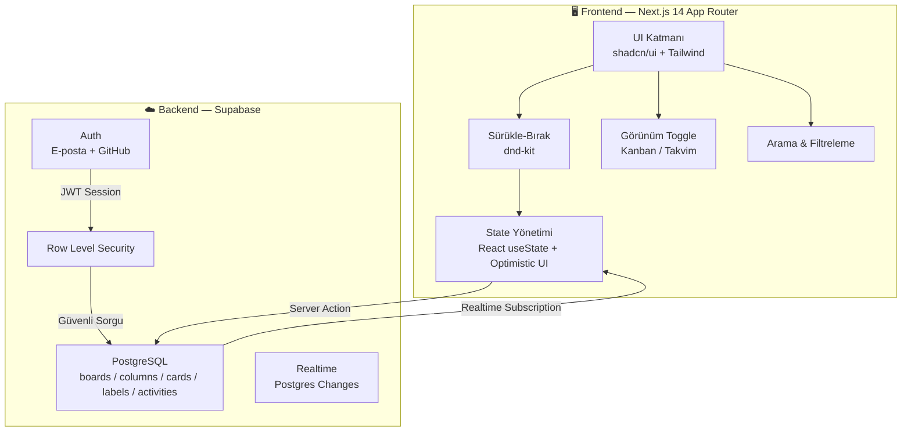

# TaskFlow — Kanban Proje Yönetim Tahtası: Güncellenmiş Uygulama Planı

---

## 📋 Proje Özeti

KoçSistem staj değerlendirmesi için 48 saatte geliştirilecek **Trello benzeri** Kanban tahtası. Temel sürükle-bırak deneyimi mükemmel olacak, ardından fark yaratan özelliklerle jüri etkilenecek.

> [!IMPORTANT]
> **Strateji:** "Her şeyi yapmaya çalışıp yarım bırakmak" yerine "temel mükemmel + seçili ekstralar mükemmel" stratejisi.

---

## 🎯 Jüri Değerlendirme Kriterleri ↔ Çözümlerimiz

| # | Jüri Kriteri | Çözüm | Durum |
|---|---|---|---|
| 1 | Sürükle-bırakın sorunsuz çalışması | `dnd-kit` + Gölge/Tilt/Drop Indicator efektleri + Optimistic UI | ✅ |
| 2 | Sıralama mantığının sağlamlığı | Lexicographical Fractional Indexing (`fractional-indexing` npm) | ✅ |
| 3 | Veri modelinin tutarlılığı | Supabase PostgreSQL: Board → Column → Card + RLS + Cascade Delete | ✅ |
| 4 | Kütüphane seçiminin bilinçli yapılması | `dnd-kit` seçim gerekçesi: Modüler, mobil uyumlu, aktif geliştirme | ✅ |
| 5 | Mobil kullanılabilirlik | `dnd-kit` TouchSensor + Long-press (250ms) + Responsive Layout | ✅ |
| 6 | Kod kalitesi ve mimari tutarlılığı | Next.js 14 App Router + TypeScript + modüler katmanlı mimari | ✅ |
| 7 | 48 saat odak noktası | Temel sürükle-bırak mükemmel → Ekstralar sıralı eklenir | ✅ |

---

## 🔧 Teknoloji Stack

| Teknoloji | Gerekçe |
|---|---|
| **Next.js 14 (App Router)** | Vercel deploy sıfır sürtünme. Server Components + Server Actions. |
| **TypeScript** | Tip güvenliği — jürinin "mimari tutarlılık" beklentisi. |
| **Tailwind CSS** | Hızlı, responsive, utility-first styling. |
| **shadcn/ui** | Erişilebilir, özelleştirilebilir, profesyonel bileşenler. |
| **dnd-kit** | React-native, modüler, mobil uyumlu sürükle-bırak. |
| **fractional-indexing** | Lexicographic sıralama — sınırsız hassasiyet, O(1) güncelleme. |
| **Supabase** | Auth + PostgreSQL + Realtime + RLS — backend'e vakit harcamayı sıfırlar. |
| **canvas-confetti** | Done sütununa kart taşıyınca konfeti efekti. |

---

## 🏗️ Mimari Tasarım

### Sistem Mimarisi



### Proje Dosya Yapısı

```
taskflow/
├── src/
│   ├── app/
│   │   ├── layout.tsx                # Root layout (font, theme, providers)
│   │   ├── page.tsx                  # Landing / Redirect
│   │   ├── globals.css               # Tailwind + özel stiller
│   │   ├── (auth)/
│   │   │   ├── login/page.tsx
│   │   │   └── register/page.tsx
│   │   └── (dashboard)/
│   │       ├── layout.tsx            # Sidebar + Navbar + Avatar + Progress
│   │       ├── boards/page.tsx       # Board listeleme
│   │       └── board/[id]/page.tsx   # Kanban tahtası (ANA SAYFA)
│   │
│   ├── components/
│   │   ├── ui/                       # shadcn/ui bileşenleri
│   │   ├── auth/
│   │   │   ├── LoginForm.tsx
│   │   │   └── RegisterForm.tsx
│   │   ├── board/
│   │   │   ├── KanbanBoard.tsx       # Ana DnD container
│   │   │   ├── KanbanColumn.tsx      # Tek sütun (droppable)
│   │   │   ├── KanbanCard.tsx        # Tek kart (draggable)
│   │   │   ├── CardDetailModal.tsx   # Kart düzenleme modalı + Aktivite Günlüğü
│   │   │   ├── CalendarView.tsx      # 📅 YENİ: Takvim Görünümü
│   │   │   ├── ViewToggle.tsx        # 📅 YENİ: Kanban/Takvim geçiş butonu
│   │   │   ├── SearchBar.tsx         # 🔍 YENİ: Arama barı
│   │   │   ├── FilterPanel.tsx       # 🔍 YENİ: Etiket/Öncelik filtresi
│   │   │   ├── LabelBadge.tsx        # 🏷️ YENİ: Renkli etiket rozeti
│   │   │   ├── ActivityLog.tsx       # 📝 YENİ: Aktivite günlüğü
│   │   │   ├── ProgressBar.tsx       # 📊 YENİ: İlerleme çubuğu
│   │   │   ├── AvatarGroup.tsx       # 👥 YENİ: Üye avatarları
│   │   │   ├── DragOverlay.tsx       # Sürükleme gölge kartı
│   │   │   ├── AddColumnButton.tsx
│   │   │   ├── AddCardButton.tsx
│   │   │   └── CreateBoardDialog.tsx
│   │   └── shared/
│   │       ├── Navbar.tsx
│   │       ├── EmptyState.tsx        # ✨ YENİ: Boş durum tasarımı
│   │       └── ConfettiEffect.tsx    # 🎉 YENİ: Done konfetisi
│   │
│   ├── lib/
│   │   ├── supabase/
│   │   │   ├── client.ts
│   │   │   ├── server.ts
│   │   │   └── middleware.ts
│   │   ├── utils.ts
│   │   └── ordering.ts              # fractional-indexing wrapper
│   │
│   ├── hooks/
│   │   ├── useBoard.ts
│   │   ├── useRealtimeCards.ts
│   │   ├── useSearch.ts             # 🔍 YENİ: Arama hook'u
│   │   └── useActivities.ts         # 📝 YENİ: Aktivite hook'u
│   │
│   ├── actions/
│   │   ├── board-actions.ts
│   │   ├── column-actions.ts
│   │   ├── card-actions.ts
│   │   └── activity-actions.ts      # 📝 YENİ: Aktivite log'lama
│   │
│   └── types/
│       └── database.ts
│
├── middleware.ts
├── tailwind.config.ts
├── next.config.js
└── package.json
```

---

## 🗄️ Veri Modeli (Supabase PostgreSQL)

```sql
-- Kullanıcı profilleri
CREATE TABLE profiles (
  id UUID REFERENCES auth.users PRIMARY KEY,
  full_name TEXT,
  avatar_url TEXT,
  created_at TIMESTAMPTZ DEFAULT NOW()
);

-- Panolar
CREATE TABLE boards (
  id UUID DEFAULT gen_random_uuid() PRIMARY KEY,
  title TEXT NOT NULL,
  user_id UUID REFERENCES profiles(id) ON DELETE CASCADE NOT NULL,
  created_at TIMESTAMPTZ DEFAULT NOW()
);

-- Sütunlar
CREATE TABLE columns (
  id UUID DEFAULT gen_random_uuid() PRIMARY KEY,
  title TEXT NOT NULL,
  board_id UUID REFERENCES boards(id) ON DELETE CASCADE NOT NULL,
  position TEXT NOT NULL,  -- Lexicographical Fractional Index
  created_at TIMESTAMPTZ DEFAULT NOW()
);

-- 🏷️ Etiketler (YENİ)
CREATE TABLE labels (
  id UUID DEFAULT gen_random_uuid() PRIMARY KEY,
  name TEXT NOT NULL,             -- "Bug", "Feature", "Acil", "Düşük Öncelik"
  color TEXT NOT NULL,            -- "#EF4444", "#3B82F6", "#F59E0B", "#10B981"
  board_id UUID REFERENCES boards(id) ON DELETE CASCADE NOT NULL
);

-- Kartlar
CREATE TABLE cards (
  id UUID DEFAULT gen_random_uuid() PRIMARY KEY,
  title TEXT NOT NULL,
  description TEXT DEFAULT '',
  column_id UUID REFERENCES columns(id) ON DELETE CASCADE NOT NULL,
  position TEXT NOT NULL,         -- Lexicographical Fractional Index
  priority TEXT DEFAULT 'none' CHECK (priority IN ('none','low','medium','high')),
  due_date DATE,                  -- 📅 YENİ: Teslim tarihi (Takvim Görünümü için)
  created_at TIMESTAMPTZ DEFAULT NOW(),
  updated_at TIMESTAMPTZ DEFAULT NOW()
);

-- 🏷️ Kart-Etiket ilişkisi (çoka-çok) (YENİ)
CREATE TABLE card_labels (
  card_id UUID REFERENCES cards(id) ON DELETE CASCADE,
  label_id UUID REFERENCES labels(id) ON DELETE CASCADE,
  PRIMARY KEY (card_id, label_id)
);

-- 📝 Aktivite Günlüğü (YENİ)
CREATE TABLE activities (
  id UUID DEFAULT gen_random_uuid() PRIMARY KEY,
  card_id UUID REFERENCES cards(id) ON DELETE CASCADE NOT NULL,
  user_id UUID REFERENCES profiles(id) ON DELETE CASCADE NOT NULL,
  action TEXT NOT NULL,           -- 'moved', 'created', 'updated', 'label_added'
  details JSONB DEFAULT '{}',    -- {"from_column": "Yapılacaklar", "to_column": "Yapılıyor"}
  created_at TIMESTAMPTZ DEFAULT NOW()
);
```

---

## ⭐ YENİ ÖZELLİKLER (Detaylı Tasarım)

### 1. 📅 Takvim Görünümü (View Toggle)

**Konum:** Sağ üstte `[Kanban Görünümü] / [Takvim Görünümü]` toggle butonu.

**Nasıl çalışır:**
- Varsayılan: Kanban görünümü
- Toggle tıklanınca: `due_date` olan kartlar takvime yerleşir
- Takvimde güne tıklanınca o günün kartları listelenir
- shadcn/ui `Calendar` bileşeni kullanılacak (basit ve hızlı)
- Kartlar küçük renkli kutucuklar olarak gösterilir (öncelik rengine göre)

**Neden:** Veri görselleştirme yeteneğini gösterir. Bazı kullanıcılar süreç (sütun), bazıları zaman (takvim) olarak görmeyi sever.

> [!TIP]
> Eğer vakit daralırsa takvimi **atlayabiliriz**. Onun yerine Arama/Filtreleme mükemmelleştirilir.

---

### 2. 🔍 Arama ve Filtreleme (Search & Filter)

**Konum:** Board üstünde arama barı + filtre butonları.

**Nasıl çalışır:**
- Yazdıkça kartlar **anında filtrelenir** (client-side, debounce ile)
- Eşleşmeyen kartlar `opacity: 0.2` ile soluklaşır (kaybolmaz, hâlâ board yapısı görünür)
- Filtre seçenekleri: Öncelik (Yüksek/Orta/Düşük) + Etiket (Bug/Feature/vb.)
- `useSearch` custom hook ile merkezi state yönetimi

**Neden:** Gerçek dünya kullanımına en uygun özellik. "Ben sadece ödev yapmıyorum, gerçek bir araç tasarlıyorum" mesajı verir.

---

### 3. 🏷️ Kart Etiketleri ve Öncelik (Labels & Priority)

**Kartın üzerinde:**
- Renkli küçük etiket rozetleri: "Bug" (kırmızı), "Feature" (mavi), "Acil" (turuncu), "Düşük Öncelik" (yeşil)
- Öncelik göstergesi: Sol kenarda ince renkli çizgi (stripe)
  - 🔴 Yüksek: Kırmızı
  - 🟡 Orta: Turuncu
  - 🟢 Düşük: Yeşil
  - ⚪ Yok: Gri

**Kart detay modalında:**
- Etiket ekleme/çıkarma (tıkla-seç dropdown)
- Öncelik seçme (dropdown)
- Due date seçme (date picker)

**Neden:** Görsel hiyerarşi sağlar. Jürinin "Görsel ipuçları kullanıcı deneyimini iyileştirir" beklentisini tam karşılar.

---

### 4. 📝 Aktivite Günlüğü (Activity Log)

**Konum:** Kart detay modalının alt kısmında.

**Gösterim:**
```
📋 Merve bu kartı 'Yapılacaklar'dan 'Yapılıyor'a taşıdı — 2 saat önce
✏️ Merve başlığı güncelledi — 3 saat önce
🏷️ Merve "Bug" etiketi ekledi — 5 saat önce
➕ Merve bu kartı oluşturdu — 1 gün önce
```

**Nasıl yapılır:**
- Her kart işleminde (taşıma, düzenleme, etiket ekleme) `activities` tablosuna bir satır ekle
- `details` JSONB sütununda ek bilgiler (`from_column`, `to_column`, `old_title`, `new_title`)
- Göreli zaman gösterimi (`date-fns` `formatDistanceToNow`)

**Neden:** Takım çalışması ruhunu yansıtır.

---

### 5. ✨ Quick Wins (Küçük Dokunuş, Büyük Etki)

#### A. Boş Durum Tasarımı (Empty States)
- Sütunda kart yoksa: Şık ikon + "Burada henüz iş yok 🎯" + "Yeni kart ekle" butonu
- Board yoksa: İllüstrasyon + "İlk board'unu oluştur!" mesajı
- Arama sonucu boşsa: "Aramanızla eşleşen kart bulunamadı" mesajı

#### B. Avatar Listesi
- Navbar'da sağ üstte 3-4 avatar (uydurma, renk tabanlı)
- Tooltip ile isim gösterimi
- `+2` stili overflow gösterimi

#### C. İlerleme Çubuğu (Progress Bar)
- Board'un en üstünde gradient renkte ince bar
- "Done" sütunundaki kartlar / Toplam kartlar = yüzde
- Animasyonlu geçiş (kart taşındığında bar güncellenir)
- Yanında metin: "3/10 görev tamamlandı (%30)"

#### D. Done Konfetisi 🎉
- Kart "Done" / "Bitti" sütununa taşındığında `canvas-confetti` ile patlama efekti
- Küçük, şık, aşırıya kaçmayan bir animasyon
- Sadece sürükle-bırakla taşımada tetiklenir

---

## 🚀 48 Saatlik Uygulama Takvimi (5 Faz)

### Faz 1: Temel Altyapı (İlk 6-8 Saat)
1. Next.js projesi oluştur (`/Users/mervesudeyanar/Desktop/koçsistem/taskflow`)
2. Supabase projesi kur, tabloları oluştur (profiles, boards, columns, cards, labels, card_labels, activities)
3. RLS politikaları yaz
4. Supabase client entegrasyonu (server + client)
5. Auth sayfaları (Login + Register) — E-posta/Şifre + GitHub
6. Board listeleme / oluşturma sayfası

### Faz 2: Kanban Çekirdeği + Sürükle-Bırak (8-10 Saat)
7. Board detay sayfası — sütunları ve kartları çek, render et
8. Yeni sütun ve kart ekleme
9. Kart detay düzenleme (başlık, açıklama, öncelik, due date)
10. `dnd-kit` entegrasyonu — kartları sütunlar arası taşıma
11. Sütunları yatay sıralama
12. `fractional-indexing` ile position hesaplama
13. Görsel efektler: gölge, tilt, drop indicator
14. Optimistic UI

### Faz 3: UX Ekstraları (6-8 Saat)
15. 🔍 Arama barı + filtreleme (label, priority)
16. 🏷️ Renkli etiketler + etiket yönetimi
17. 📝 Aktivite günlüğü (kart taşıma/düzenleme logları)
18. ✨ Empty states (boş sütun, boş board, boş arama)
19. 👥 Avatar listesi (navbar)
20. 📊 İlerleme çubuğu (progress bar)

### Faz 4: Görsel Şov + Bonus (4-6 Saat)
21. 📅 Takvim Görünümü (View Toggle)
22. 🎉 Done konfetisi
23. Supabase Realtime (canlı güncelleme)
24. Mobil responsive düzenleme

### Faz 5: Profesyonellik + Deploy (2-4 Saat)
25. Harika bir README.md (GIF, mimari diyagram, kurulum rehberi)
26. Vercel'a deploy
27. Environment variable'lar
28. Canlı test ve son kontroller

---

## 📱 Mobil Strateji

- `dnd-kit` **PointerSensor** (masaüstü) + **TouchSensor** (mobil)
- TouchSensor: `activationConstraint: { delay: 250, tolerance: 5 }` — 250ms uzun basma
- Sütunlar mobilde **yatay kaydırma** (horizontal scroll snap)
- Kart detay modal: bottom sheet stili

---

## 🎨 Görsel Efektler

| Aşama | Efekt | Teknik |
|---|---|---|
| **Sürükleme Başlangıcı** | Kart havaya kalkar, yana yatar | `shadow-2xl` + `scale(1.05)` + `rotate(3deg)` |
| **Sürükleme Sırasında** | Orijinal yerde yarı-saydam hayalet | Placeholder `opacity: 0.4` |
| **Bırakma Alanı** | Hedef konumda mavi vurgu çizgisi | Drop indicator animasyonu |
| **Bırakma Anı** | Kart yumuşakça yerine oturur | `transition: all 200ms ease` |
| **Done'a Taşıma** | Konfeti patlaması | `canvas-confetti` |

---

## 🧪 Doğrulama Planı (Verification)

### Fonksiyonel Testler
- Kayıt → Giriş → Board oluştur → Sütun ekle → Kart ekle → Sürükle-Bırak → Sayfa yenile → Sıra korundu mu?
- Kart sütunlar arası taşındığında `column_id` ve `position` doğru mu?
- Sütun silindiğinde kartlar da siliniyor mu? (Cascade Delete)
- Arama yazdıkça kartlar filtreleniyor mu?
- Etiket ekle/çıkar çalışıyor mu?
- Aktivite logları doğru yazılıyor mu?

### Görsel / UX Testler
- Sürüklerken gölge + tilt efekti var mı?
- Drop indicator beliriyor mu?
- Mobil uzun basma çalışıyor mu?
- Boş sütunda empty state görünüyor mu?
- Progress bar güncel mi?
- Done'a taşıyınca konfeti patlatıyor mu?
- Takvim/Kanban toggle çalışıyor mu?

### Realtime Test
- İki sekme açıp bir sekmede kart taşıyınca diğerinde güncelleniyor mu?

### Deploy Testi
- Vercel canlı linkte tüm akış çalışıyor mu?
- Supabase bağlantısı production'da sağlıklı mı?

---

## Kapsam Dışı (Bilinçli Kararlar)

| Özellik | Neden Yapmıyoruz |
|---|---|
| Board paylaşma / birlikte düzenleme | Yetkilendirme karmaşıklığı, 48 saatte patlar |
| Dosya eki yükleme | Storage yönetimi gereksiz karmaşıklık |
| Bildirim sistemi | Temel UX'e değer katmaz |
| AI Task Breakdown | Vakit kalırsa Faz 4'te eklenebilir, ama öncelik değil |

> [!WARNING]
> **AI Task Breakdown hakkında:** Orijinal planda vardı ama Takvim Görünümü, Arama/Filtreleme, Etiketler ve Aktivite Günlüğü ile beraber yapılırsa 48 saate sığmama riski yüksek. Bu yüzden "nice-to-have" olarak bırakıldı. Eğer istersen listeye geri ekleyebiliriz.

---

## Açık Sorular

> [!IMPORTANT]
> 1. **Supabase Projesi:** Supabase hesabın var mı? Yoksa birlikte mi oluşturalım?
> 2. **GitHub Auth:** Sadece E-posta/Şifre yeterli mi, yoksa GitHub ile giriş de olsun mu?
> 3. **AI Task Breakdown:** Bu özelliği de eklememi ister misin, yoksa yukarıdaki listeyle devam mı?
> 4. **Varsayılan Etiketler:** Board oluşturulunca hangi etiketler otomatik gelsin? Öneri: "Bug" (kırmızı), "Feature" (mavi), "İyileştirme" (mor), "Acil" (turuncu)
